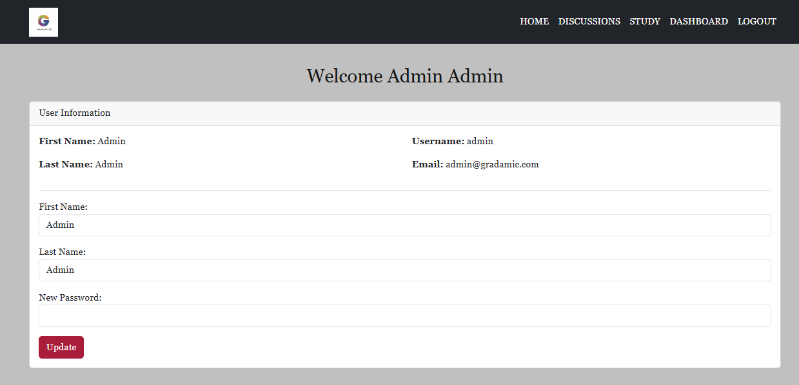

# Gradamic

Codebase for [Gradamic.com](https://app.gradamic.com/)

## Table of Contents

- [Introduction](#introduction)
- [Features](#features)
- [Getting Started](#getting-started)
    - [Prerequisites](#prerequisites)
    - [Installation](#installation)
- [Contributing](#contributing)
- [Contact](#contact)

## Introduction

At Gradamic, we believe in the power of education to transform lives. We are committed to providing high-quality study materials and resources to help you succeed academically and professionally.

Whether you're a student looking to excel in your studies, a professional seeking to advance your career, or an educator striving to inspire the next generation, Gradamic is here to support you every step of the way.

Our comprehensive collection of study materials covers a wide range of subjects, from mathematics and science to literature and history. With our user-friendly platform, you can easily access and explore resources tailored to your learning needs.

Gradamic aims to provide accessible and engaging learning resources, specifically for students studying B.Tech. It addresses the challenge of last-minute note-gathering by offering free, high-quality notes, so that students don't need to worry about balancing academics and skill development.

## Features

### 1. Home

### 2. Dashboard

### 3. Study

### 4. Discussion

## Getting Started

### Prerequisites

* Python (v3.9 or higher)
* Django (Specify version - e.g., Django 4.x)
* JavaScript PDF libraries (Specify which ones - e.g., PDF.js)
* HTML, CSS (Bootstrap)
* Linux (Ubuntu) Operating System (Recommended)
* Nginx (Recommended for production)
* Amazon EC2 Instance (For hosting)
* GoDaddy Domain Services (For domain management)

### Installation

1. Clone the repository: `git clone https://github.com/prakhar0x01/Gradamic.git`
2. Navigate to the project directory: `cd Gradamic`
   *(Further installation steps would be helpful here, e.g., setting up virtual environments, installing dependencies, database migrations, etc.)*

## Contributing

1. Fork the repository.
2. Create a new branch for your feature or bug fix.
3. Make your changes.
4. Submit a pull request.  *(Consider adding guidelines for code style, testing, etc.)*

## Contact

- Email: [gradamic.info@gmail.com](mailto:gradamic.info@gmail.com)
- GitHub: [@prakhar0x01](https://github.com/prakhar0x01)
